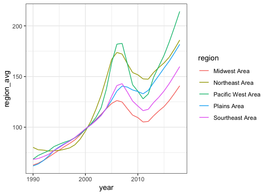

<!-- README.md is generated from README.Rmd. Please edit that file -->

# yang7er

<!-- badges: start -->
<!-- badges: end -->

The goal of yang7er is to calculating the difference between state and
regional hpi, as well as graphing the change in state hpi, and the
change in regional hpi.

## Installation

You can install the development version of yang7er from
[GitHub](https://github.com/) with:

``` r
# install.packages("devtools")
devtools::install_github("etc5523-2022/rpkg-yang7er")
```

## Example

This is a basic example which shows you how to solve a common problem:

``` r
library(yang7er)
## basic example code
```

### 1.get_hpi

If you want to check the build-in data, you can use:

``` r
get_hpi()
#> Rows: 26877 Columns: 5
#> ── Column specification ────────────────────────────────────────────────────────
#> Delimiter: ","
#> chr (1): state
#> dbl (4): year, month, price_index, us_avg
#> 
#> ℹ Use `spec()` to retrieve the full column specification for this data.
#> ℹ Specify the column types or set `show_col_types = FALSE` to quiet this message.
#> Joining, by = "state"
#> # A tibble: 26,877 × 9
#> # Groups:   year, region [220]
#>     year month state price_index us_avg year_avg us_year_avg region      regio…¹
#>    <dbl> <dbl> <chr>       <dbl>  <dbl>    <dbl>       <dbl> <chr>         <dbl>
#>  1  1975     1 AK           34.6   23.5     37.2        24.2 Pacific We…    26.4
#>  2  1975     2 AK           35.1   23.6     37.2        24.2 Pacific We…    26.4
#>  3  1975     3 AK           35.5   23.8     37.2        24.2 Pacific We…    26.4
#>  4  1975     4 AK           35.9   24.1     37.2        24.2 Pacific We…    26.4
#>  5  1975     5 AK           36.3   24.2     37.2        24.2 Pacific We…    26.4
#>  6  1975     6 AK           36.7   24.2     37.2        24.2 Pacific We…    26.4
#>  7  1975     7 AK           37.2   24.3     37.2        24.2 Pacific We…    26.4
#>  8  1975     8 AK           37.7   24.4     37.2        24.2 Pacific We…    26.4
#>  9  1975     9 AK           38.4   24.5     37.2        24.2 Pacific We…    26.4
#> 10  1975    10 AK           39.1   24.6     37.2        24.2 Pacific We…    26.4
#> # … with 26,867 more rows, and abbreviated variable name ¹​region_avg
```

### 2.diff_region_state

If you want to get the information of `Ak`, in `2006`, you can use:

``` r
diff_region_state("AK",2016)
#> # A tibble: 1 × 6
#> # Groups:   state, year [1]
#>    year state region            region_avg state_avg  diff
#>   <dbl> <chr> <chr>                  <dbl>     <dbl> <dbl>
#> 1  2016 AK    Pacific West Area       184.      174.  9.83
```

### 3.diff_plot

If you want to plot the `AK's` hpi change, and compare with its region’s
change, you can use:

``` r
diff_plot("AK")
```


### 4.regions_plot

If you want to plot regions’ hpi change from `1990` to `2018`, you can
use:

``` r
regions_plot(1990,2018)
```


